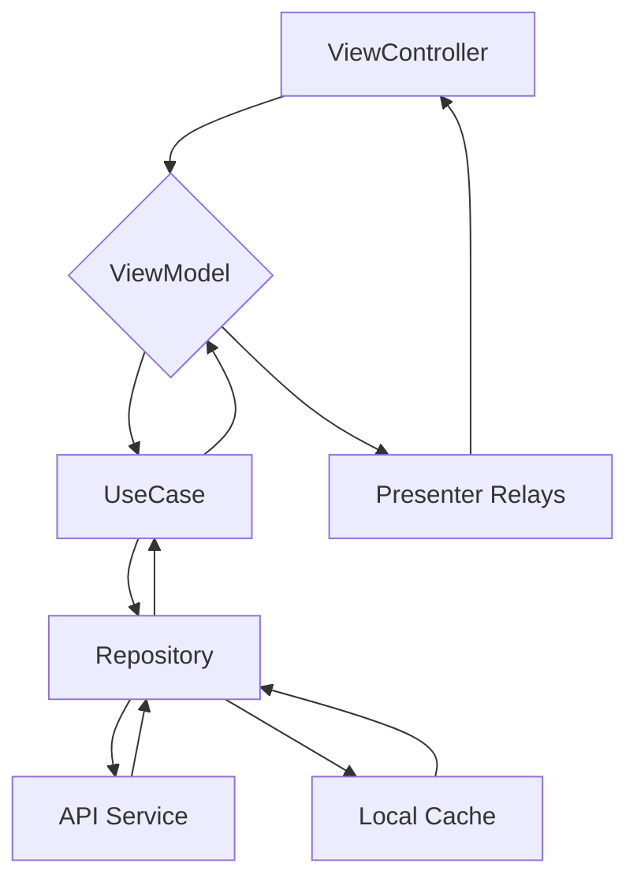
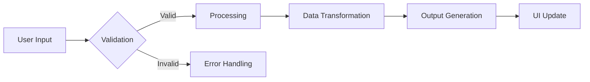
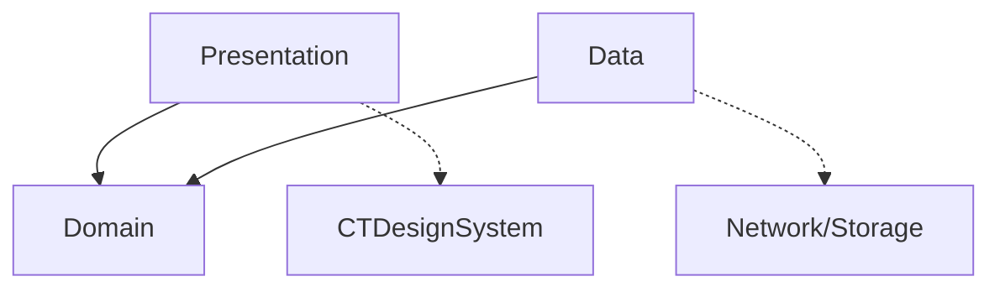

<!-- Generated by Ruler -->


<!-- Source: .ruler/AGENTS.md -->

# Cho Tot iOS - Agent Guide

This document provides a central hub for all AI agent instructions. For detailed guidelines, please refer to the individual rule files in the `.ruler/` directory.

## Commands

### Setup

```bash
make bootstrap          # Install bundler, CocoaPods, and Recaptcha dependencies
pod install             # Install CocoaPods dependencies only
```

### Testing

```bash
fastlane ios tests      # Run unit tests with code coverage
```

### Linting

```bash
swiftlint lint --config .swiftlint.yml --strict <files>   # Lint specific files
```

### Code Generation

```bash
python bin/gen_ecs_enum.py                      # Regenerate ECS enums
scripts/set-claude-context.sh <ModuleName>      # Switch Claude MCP context to a module
```

### Ruler (AI Agent Rules)

```bash
make ruler-apply                              # Apply ruler rules to project root
make ruler-apply-module MODULE_PATH=<path>    # Apply ruler to a specific module
make ruler-setup-all                          # Apply ruler to all AppFeatures/Libraries
```

## Architecture Summary

**MVVM + Clean Architecture** — 3 protocol layers per feature:

- `[Feature]ViewModelType` — ViewModel protocol (conforms to `CTViewModelType`)
- `[Feature]Presentable` — ViewController protocol exposing `BehaviorRelay`/`PublishRelay` state
- `[Feature]PresentableListener` — ViewController → ViewModel trigger relays (user interactions)

**Data flow:**

```
ViewController triggers → ViewModel (via PresentableListener relays)
                       → UseCase (CTActionUseCaseType, action?.execute)
                       → Repository → Service → API Target
                       ← UseCase action?.elements
                       ← Presenter relays (BehaviorRelay.accept)
                       ← ViewController binds to UI
```

**6-Layer UseCase pattern** (when adding a new API):
`NetworkHelper (Api.key)` → `Targets` → `Service` → `Repository` → `UseCase` → `ViewModel`

**DI**: Swinject + `CCDefaultAssembler`. Each module has an `Assembler/` directory.

**Key libraries**: RxSwift 6, SnapKit, CTDesignSystem (custom DS), R.swift, Quick/Nimble (tests).

## Core Guidelines

- **Project Overview**: See `.ruler/ct-ai-rule-project-overview.md`
- **Architecture**: See `.ruler/ct-ai-rule-core-architecture.md`
- **Code Style**: See `.ruler/ct-ai-rule-code-standards.md`
- **Design System**: See `.ruler/ct-ai-rule-design-system.md`
- **Mermaid Diagrams**: See `.ruler/ct-ai-rule-mermaid-diagrams.md`
- **Scaffolding & Templates**: See `.ruler/ct-ai-rule-scaffolding.md`

## General Rules & Dependency Injection

- **General Rules**: See `.ruler/ct-ai-general-rules.md`

## Module-Specific Guidelines

### AppFeatures

- **CTAdView**: See `AppFeatures/CTAdView/AGENTS.md`
- **CTAIChat**: See `AppFeatures/CTAIChat/AGENTS.md`
- **CTAuthentication**: See `AppFeatures/CTAuthentication/AGENTS.md`
- **CTChat**: See `AppFeatures/CTChat/AGENTS.md`
- **CTCorePayment**: See `AppFeatures/CTCorePayment/AGENTS.md`
- **CTEcommerce**: See `AppFeatures/CTEcommerce/AGENTS.md`
- **CTFeed**: See `AppFeatures/CTFeed/AGENTS.md`
- **CTGoods**: See `AppFeatures/CTGoods/AGENTS.md`
- **CTInsertAd**: See `AppFeatures/CTInsertAd/AGENTS.md`
- **CTJOB**: See `AppFeatures/CTJOB/AGENTS.md`
- **CTLiveStream**: See `AppFeatures/CTLiveStream/AGENTS.md`
- **CTLogin**: See `AppFeatures/CTLogin/AGENTS.md`
- **CTPartnerPortal**: See `AppFeatures/CTPartnerPortal/AGENTS.md`
- **CTPos**: See `AppFeatures/CTPos/AGENTS.md`
- **CTPrivateDashboard**: See `AppFeatures/CTPrivateDashboard/AGENTS.md`
- **CTPTY**: See `AppFeatures/CTPTY/AGENTS.md`
- **CTReferral**: See `AppFeatures/CTReferral/AGENTS.md`
- **CTReward**: See `AppFeatures/CTReward/AGENTS.md`
- **CTShop**: See `AppFeatures/CTShop/AGENTS.md`
- **CTUserManagement**: See `AppFeatures/CTUserManagement/AGENTS.md`
- **CTVEH**: See `AppFeatures/CTVEH/AGENTS.md`
- **CTVEHBrandModel**: See `AppFeatures/CTVEHBrandModel/AGENTS.md`

### Libraries

- **CTApiClient**: See `Libraries/CTApiClient/AGENTS.md`
- **CTAsset**: See `Libraries/CTAsset/AGENTS.md`
- **CTCommon**: See `Libraries/CTCommon/AGENTS.md`
- **CTComponent**: See `Libraries/CTComponent/AGENTS.md`
- **CTDesignSystem**: See `Libraries/CTDesignSystem/AGENTS.md`
- **CTEscrow**: See `Libraries/CTEscrow/AGENTS.md`
- **CTLocalize**: See `Libraries/CTLocalize/AGENTS.md`
- **CTTracking**: See `Libraries/CTTracking/AGENTS.md`
- **CTUseCaseCommon**: See `Libraries/CTUseCaseCommon/AGENTS.md`
- **CTUserAdCommon**: See `Libraries/CTUserAdCommon/AGENTS.md`

## Tooling & Automation

- **ECS Generation**: See `.ruler/ct-ai-general-rules.md`
- **MCP Integration**: See `.ruler/ct-ai-general-rules.md`

## Additional Rules

- **Swift Style Guide**: See `.ruler/ct-ai-rule-swift-style.md`
- **Module Architecture**: See `.ruler/ct-ai-rule-module-architecture.md`
- **RxSwift Patterns**: See `.ruler/ct-ai-rule-rxswift.md`
- **General Unit Testing**: See `.ruler/ct-ai-rule-testing-general.md`
- **SwiftUI Development**: See `.ruler/ct-ai-rule-swiftui.md`

## AI Agent Guidelines

- **Agent Guidelines**: See `.ruler/ct-ai-rule-agent-guidelines.md`

## IMPORTANT NOTE

- Prefer to use Logger.print() info from CTCommon module instead of print() for logging.
- No need to run swift build.
- For the file comment header, use created by [Your Name] on [Date]. use time mcp for the date, and Copyright © 2024 Cho Tot. All rights reserved. Your Name is from git config user.name, fallback to Chợ Tốt as default name.
- For color and theme, please reference CTDesignSystem, CTTheme.swift. Do not use UIColor or Color directly. Use set theme pattern instead. For example: label.setStyle(DS.TypoToken.Header.Section(color: theme.text.textPrimary.color))
- Time: Very important: The user's timezone is {datetime(.)now().strftime("%Z")}. The current date is {datetime(.)now().strftime("%Y-%m-%d")}. Any dates before this are in the past, and any dates after this are in the future. When the user asks for the 'latest', 'most recent', 'today's', etc. don't assume your knowledge is up to date.
- Follow the DRY (Don't Repeat Yourself) principles. For example, if you have a function that is used in multiple places, create a new function for it. Do not copy and paste the same code in multiple places. Do not use the same code in multiple places.


<!-- Source: .ruler/ct-ai-general-rules.md -->

---
alwaysApply: true
---

# General Rules for Cho Tot iOS

This file contains general rules and guidelines that are referenced throughout the project.

## Dependency Injection

-   Use the custom Assembler pattern with `CCDefaultAssembler`
-   Always define protocols for services and repositories
-   Inject dependencies through initializers

## MCP Integration

-   Use MCP for enhanced context when available

## Tooling & Automation

### ECS Generation

-   Use `gen_ecs_enum.py` for generating ECS enums
-   Follow the established patterns in the script
-   Update the script when adding new ECS types


<!-- Source: .ruler/ct-ai-rule-agent-guidelines.md -->

# AI Agent Guidelines

## Code Generation Rules

1. **Component Priority**: Always use CTDesignSystem before UIKit. Look for examples in `./Libraries/CTDesignSystem/CTDesignSystemExampleApp/SampleApp` for complete Design System usage.
2. **Layout Compliance**: Use SnapKit for ALL constraints
3. **Architecture**: Follow MVVM + Clean Architecture
4. **Quality**: Include SwiftLint compliance and unit tests
5. **Security**: Validate inputs, never log sensitive data

## Prohibited Practices

-   Mixing UIKit and CTDesignSystem components
-   Using different constraint systems
-   Bypassing input validation
-   Generating conflicting architectural patterns

## Naming Conventions

-   **Types**: `UpperCamelCase` (classes, protocols, structs, enums)
-   **Functions & Variables**: `lowerCamelCase`
-   **Constants**: `lowerCamelCase` or `UPPER_SNAKE_CASE` for global constants
-   **Files**: Match the primary type they contain

## Module Creation Guidelines

-   **DO NOT create full modules unless explicitly requested**: When asked to create a ViewModel, ViewController, or other component, create only the specific file(s) requested within existing modules.
-   **Focus on individual components**: Create single files (e.g., ViewModels, ViewControllers) rather than entire module structures.
-   **Use existing module structure**: Place new components in appropriate existing modules based on their functionality.
-   **Exception**: Only create full modules when the user specifically asks for "create a new feature module" or similar explicit requests.

## Module-Specific Agent Guides

### AppFeatures

-   [CTAdView](../AppFeatures/CTAdView/AGENTS.md)
-   [CTAuthentication](../AppFeatures/CTAuthentication/AGENTS.md)
-   [CTChat](../AppFeatures/CTChat/AGENTS.md)
-   [CTCorePayment](../AppFeatures/CTCorePayment/AGENTS.md)
-   [CTEcommerce](../AppFeatures/CTEcommerce/AGENTS.md)
-   [CTFeed](../AppFeatures/CTFeed/AGENTS.md)
-   [CTFooBar](../AppFeatures/CTFooBar/AGENTS.md)
-   [CTGoods](../AppFeatures/CTGoods/AGENTS.md)
-   [CTInsertAd](../AppFeatures/CTInsertAd/AGENTS.md)
-   [CTJOB](../AppFeatures/CTJOB/AGENTS.md)
-   [CTLiveStream](../AppFeatures/CTLiveStream/AGENTS.md)
-   [CTLogin](../AppFeatures/CTLogin/AGENTS.md)
-   [CTPartnerPortal](../AppFeatures/CTPartnerPortal/AGENTS.md)
-   [CTPos](../AppFeatures/CTPos/AGENTS.md)
-   [CTPrivateDashboard](../AppFeatures/CTPrivateDashboard/AGENTS.md)
-   [CTPTY](../AppFeatures/CTPTY/AGENTS.md)
-   [CTReferral](../AppFeatures/CTReferral/AGENTS.md)
-   [CTReward](../AppFeatures/CTReward/AGENTS.md)
-   [CTShop](../AppFeatures/CTShop/AGENTS.md)
-   [CTUserAdCommon](../AppFeatures/CTUserAdCommon/AGENTS.md)
-   [CTUserManagement](../AppFeatures/CTUserManagement/AGENTS.md)
-   [CTVEH](../AppFeatures/CTVEH/AGENTS.md)
-   [CTVEHBrandModel](../AppFeatures/CTVEHBrandModel/AGENTS.md)

### Libraries

-   [CTApiClient](../Libraries/CTApiClient/AGENTS.md)
-   [CTAsset](../Libraries/CTAsset/AGENTS.md)
-   [CTCommon](../Libraries/CTCommon/AGENTS.md)
-   [CTComponent](../Libraries/CTComponent/AGENTS.md)
-   [CTDesignSystem](../Libraries/CTDesignSystem/AGENTS.md)
-   [CTEscrow](../Libraries/CTEscrow/AGENTS.md)
-   [CTLocalize](../Libraries/CTLocalize/AGENTS.md)
-   [CTTracking](../Libraries/CTTracking/AGENTS.md)
-   [CTUseCaseCommon](../Libraries/CTUseCaseCommon/AGENTS.md)
-   [CTUserAdCommon](../Libraries/CTUserAdCommon/AGENTS.md)


<!-- Source: .ruler/ct-ai-rule-code-standards.md -->

# Code Standards

## Required Imports

```swift
import UIKit
import CTDesignSystem
import CTCommon
import CTLocalize
import CTComponent
import CTAsset
import RxSwift
import RxRelay
import Swinject
import CTTracking
import SnapKit
```

## UI Components (MANDATORY)

-   **ALWAYS** use CTDesignSystem components over UIKit:
    -   `DSLabel` instead of `UILabel`
    -   `DSButton` instead of `UIButton`
    -   `DSTextField` instead of `UITextField`
-   **ALWAYS** use SnapKit for Auto Layout
-   **NEVER** use NSLayoutConstraint or Interface Builder

## File Organization

```swift
import UIKit
import CTDesignSystem
import SnapKit

// MARK: - Protocols
protocol MyProtocol { }

final class YourViewController: UIViewController, MyPresentable {
    // MARK: - Properties
    enum Config { }
    var viewModel: MyViewModelType?
    weak var listener: MyPresentableListener?

    // MARK: - UI Components
    lazy var titleLabel: DSLabel = {
        let label = DSLabel()
        label.setStyle(DS.TypoToken.Label.Caption(color: theme.text.textPrimary.color))
        return label
    }()

    // MARK: - Life Cycle
    override func viewDidLoad() {
        super.viewDidLoad()
        setupViews()
        configurePresenter()
        configureViewModel()
    }

    // MARK: - Private functions
    private func setupViews() { }
    private func configurePresenter() { }
    private func configureViewModel() { }
}
```

## Code Organization

```swift
// MARK: - Properties
// MARK: - Initializers
// MARK: - Lifecycle
// MARK: - Public Methods
// MARK: - Private Methods
// MARK: - Protocol Conformance
```

## Error Handling

-   Use Swift's Result type for network operations
-   Avoid force unwrapping (`!`) - use guard statements or nil coalescing
-   Handle errors gracefully with user-friendly messages


<!-- Source: .ruler/ct-ai-rule-core-architecture.md -->

# Core Architecture Standards

This document provides a focused view of the MVVM + Clean Architecture standards. For a more comprehensive overview of the project, see [Project Overview](ct-ai-rule-project-overview.md).

## MVVM + Clean Architecture Layers

1. **Presentation**: ViewControllers, Views, ViewModels
2. **Domain**: Use Cases, Business Logic
3. **Data**: Repositories, Services, API Clients

## MVVM Components

-   **ViewModel**: Implements `CTViewModelType` with presenter, router, listener
-   **Presenter**: Protocol sending data to ViewController via `BehaviorRelay`/`PublishRelay`
-   **PresenterListener**: Protocol for ViewController → ViewModel triggers
-   **Router**: Navigation protocol

## Architecture Best Practices

-   **Strictly follow MVVM + Clean Architecture pattern**
-   **ViewControllers** handle UI events and delegate to ViewModels
-   **ViewModels** conform to `CTViewModelType` protocol
-   **Use Cases** contain business logic
-   **Repositories** abstract data access
-   **Use CTDesignSystem** components whenever possible, look for examples in `./Libraries/CTDesignSystem/CTDesignSystemExampleApp/SampleApp` for complete Design System usage.
-   **For layout, use SnapKit** - never use Interface Builder or manual `NSLayoutConstraint`s


<!-- Source: .ruler/ct-ai-rule-design-system.md -->

---
globs: Libraries/CTDesignSystem/**,**/Views/**,**/ViewControllers/**
---

# CTDesignSystem Component Usage Rules

## Component Priority

**ALWAYS use CTDesignSystem components instead of raw UIKit/SwiftUI components**

### Required Component Mappings

-   `DSLabel` instead of `UILabel`
-   `DSButton` instead of `UIButton`
-   `DSTextField` instead of `UITextField`
-   `DSImageView` instead of `UIImageView`
-   `DSStackView` instead of `UIStackView`
-   `DSScrollView` instead of `UIScrollView`

## Component Creation Guidelines

### When to Create New Components

-   Component will be used in 3+ places
-   Component encapsulates complex styling logic
-   Component provides consistent behavior across the app

## Layout Requirements with SnapKit

```swift
// ✅ Good - Using SnapKit with semantic naming
titleLabel.snp.makeConstraints { make in
    make.top.equalTo(containerView.snp.top).offset(16)
    make.leading.trailing.equalTo(containerView).inset(20)
}

// ❌ Bad - Manual constraints or Interface Builder
titleLabel.translatesAutoresizingMaskIntoConstraints = false
```

## Theming and Styling

-   Use `CTTheme` for consistent colors, fonts, and spacing
-   Components should support light/dark mode automatically
-   Reference design tokens from `CTDesignSystem`

## Component Documentation and Examples

For implementation examples and usage patterns, refer to the **CTDesignSystemExampleApp** located in `Libraries/CTDesignSystem/CTDesignSystemExampleApp`. This sample app demonstrates:

-   Proper usage of all CTDesignSystem components
-   Component customization and styling
-   Integration with SnapKit constraints
-   Theme and accessibility support
-   Best practices for component composition

## Best Practices

-   **Composition over inheritance** - prefer protocols
-   **Small, focused components** - single responsibility
-   **Consistent naming** - follow DS prefix convention
-   **Reusable styling** - avoid hardcoded values
-   **Performance conscious** - minimize view hierarchy depth
-   **Accessibility** - ensure components are accessible
-   **Reference** - Look for examples in `./Libraries/CTDesignSystem/CTDesignSystemExampleApp/SampleApp` for complete Design System usage.


<!-- Source: .ruler/ct-ai-rule-mermaid-diagrams.md -->

# Mermaid Diagram Generation

Create architecture workflow and specification diagrams:

## Architecture Workflow



## Specifications




<!-- Source: .ruler/ct-ai-rule-module-architecture.md -->

---
globs: AppFeatures/**
---

# Module Architecture Rules for ChoTot iOS

## Standard Module Structure

Every feature module **MUST** follow this exact directory structure:

```
AppFeatures/FeatureName/
├── FeatureName/
│   ├── Presentation/
│   │   ├── ViewControllers/     # UI Controllers
│   │   ├── Views/              # Custom UI Components
│   │   └── ViewModels/         # Presentation Logic
│   ├── Domain/
│   │   ├── UseCases/          # Business Logic
│   │   └── Models/            # Domain Entities
│   ├── Data/
│   │   ├── Repositories/      # Data Access Abstraction
│   │   └── Services/          # Network/Data Services
│   ├── Assembler/             # Dependency Injection
│   └── Tests/                 # Module Tests
```

## Layer Responsibilities

### Presentation Layer

-   **ViewControllers**: Handle UI events, lifecycle, navigation
-   **Views**: Custom UI components using `CTDesignSystem`
-   **ViewModels**: Transform domain data for UI, handle user interactions
    -   Must conform to `CTViewModelType`
    -   Use RxSwift for reactive bindings
    -   No direct network calls (delegate to Use Cases)

### Domain Layer

-   **UseCases**: Contain pure business logic (single responsibility)
-   **Models**: Domain entities and value objects (immutable when possible)

### Data Layer

-   **Repositories**: Abstract data access (implement Domain protocols)
-   **Services**: Concrete implementations (API clients, database handlers)

## Dependency Rules



-   **Presentation** can only depend on **Domain**
-   **Data** can only depend on **Domain**
-   **Domain** has NO dependencies on other layers
-   Cross-layer communication through protocols only

## File Naming Conventions

-   ViewControllers: `FeatureNameViewController.swift`
-   ViewModels: `FeatureNameViewModel.swift`
-   Use Cases: `FeatureNameUseCase.swift`
-   Repositories: `FeatureNameRepositoryType.swift` (protocol), `FeatureNameRepository.swift` (implementation)
-   Models: descriptive names like `User.swift`, `Product.swift`

## Inter-Module Communication

-   Use **protocols** for loose coupling
-   **Avoid direct module imports** where possible
-   Communicate through **shared domain models**
-   Use **dependency injection** for module dependencies


<!-- Source: .ruler/ct-ai-rule-project-overview.md -->

# Cho Tot iOS - Project Overview

Large-scale iOS app using Swift with MVVM + Clean Architecture. Monorepo with CocoaPods dependencies.

## MVVM + Clean Architecture Layers

1. **Presentation**: ViewControllers, Views, ViewModels
2. **Domain**: Use Cases, Business Logic
3. **Data**: Repositories, Services, API Clients

## MVVM Components

-   **ViewModel**: Implements `CTViewModelType` with presenter, router, listener
-   **Presenter**: Protocol sending data to ViewController via `BehaviorRelay`/`PublishRelay`
-   **PresenterListener**: Protocol for ViewController → ViewModel triggers
-   **Router**: Navigation protocol

## Architecture Best Practices

-   **Strictly follow MVVM + Clean Architecture pattern**
-   **ViewControllers** handle UI events and delegate to ViewModels
-   **ViewModels** conform to `CTViewModelType` protocol
-   **Use Cases** contain business logic
-   **Repositories** abstract data access
-   **Use CTDesignSystem** components whenever possible
-   **For layout, use SnapKit** - never use Interface Builder or manual `NSLayoutConstraint`s

## Key Technologies

-   **Language**: Swift
-   **Architecture**: MVVM + Clean Architecture
-   **UI Framework**: Custom CTDesignSystem
-   **Layout**: SnapKit
-   **Reactive Programming**: RxSwift
-   **Dependency Injection**: Swinject
-   **Testing**: Quick/Nimble

## Project Structure

```
ct-ios-app/
├── AppFeatures/     # Feature modules
├── Libraries/       # Shared libraries
├── ChoTot/          # Main app target
└── ...
```

## Standardized Directory Organization

```
AppFeatures/
├── FeatureName/
│   ├── Presentation/
│   │   ├── ViewControllers/
│   │   ├── Views/
│   │   └── ViewModels/
│   ├── Domain/
│   │   ├── UseCases/
│   │   └── Models/
│   ├── Data/
│   │   ├── Repositories/
│   │   └── Services/
│   └── Tests/
```

## Additional Resources

1. [Kodeco Swift Style Guide](https://github.com/kodecocodes/swift-style-guide)
2. [SnapKit Documentation](https://snapkit.io/)
3. [RxSwift Documentation](https://github.com/ReactiveX/RxSwift)


<!-- Source: .ruler/ct-ai-rule-rxswift.md -->

---
description: "RxSwift reactive programming patterns and best practices"
---

# RxSwift Guidelines for ChoTot iOS

## Core Principles

-   Use RxSwift for **reactive data flow** in ViewModels
-   **Avoid complex operator chains** - prefer readable code
-   **Always manage subscriptions** with DisposeBag
-   **Use operators judiciously** - simple is better

## ViewModel Reactive Patterns

### Input/Output Pattern

```swift
protocol [Name]ViewModelType {
    associatedtype Input
    associatedtype Output
    func transform(input: Input) -> Output
}

class [Name]ViewModel: [Name]ViewModelType {
    struct Input {
        let refreshTrigger: Observable<Void>
        let loadMoreTrigger: Observable<Void>
    }

    struct Output {
        let items: Observable<[ItemType]>
        let isLoading: Observable<Bool>
        let error: Observable<Error?>
    }

    private let disposeBag = DisposeBag()

    func transform(input: Input) -> Output {
        let items = input.refreshTrigger
            .flatMapLatest { [weak self] _ in
                self?.loadItems() ?? .empty()
            }
            .share(replay: 1)

        return Output(
            items: items,
            isLoading: activityIndicator.asObservable(),
            error: errorTracker.asObservable()
        )
    }
}
```

## Memory Management

### DisposeBag Usage

```swift
// ✅ Good - Property disposal
private let disposeBag = DisposeBag()

// ✅ Good - Weak references to prevent retain cycles
observable
    .subscribe(onNext: { [weak self] value in
        self?.handleValue(value)
    })
    .disposed(by: disposeBag)
```

## Common Operators

### Transformation

```swift
// ✅ Map for simple transformations
itemObservable
    .map { item in item.displayName }
    .bind(to: nameLabel.rx.text)
    .disposed(by: disposeBag)

// ✅ FlatMap for async operations
searchQuery
    .debounce(.milliseconds(300), scheduler: MainScheduler.instance)
    .flatMapLatest { query in
        searchService.search(query)
    }
    .bind(to: resultsTableView.rx.items)
    .disposed(by: disposeBag)
```

## Subjects and Relays

### When to Use Each

```swift
// ✅ BehaviorRelay - for state that doesn't complete
private let itemsRelay = BehaviorRelay<[ItemType]>(value: [])
var items: Observable<[ItemType]> { itemsRelay.asObservable() }

// ✅ PublishSubject - for events
private let errorSubject = PublishSubject<Error>()
var errors: Observable<Error> { errorSubject.asObservable() }
```

## Performance Guidelines

-   **Use `share(replay: 1)`** for expensive observables accessed multiple times
-   **Prefer cold observables** for one-time operations
-   **Use appropriate schedulers** - background for heavy work, main for UI
-   **Dispose subscriptions properly** - always use DisposeBag

## Anti-Patterns to Avoid

```swift
// ❌ Don't nest subscriptions - use flatMap instead
// ❌ Don't ignore errors - handle them appropriately
// ❌ Don't use blocking operators on main thread
// ❌ Don't create unnecessary subjects - use operators
```

## Best Practices Summary

-   **Keep operator chains readable** - break complex chains into multiple steps
-   **Handle errors gracefully** with appropriate recovery
-   **Use weak/unowned references** to prevent retain cycles
-   **Prefer operators over imperative code** when it improves readability


<!-- Source: .ruler/ct-ai-rule-scaffolding.md -->

# Scaffolding Templates

## ViewController Template

```swift
import UIKit
import CTDesignSystem
import CTCommon
import RxSwift
import SnapKit

final class [Name]ViewController: UIViewController, [Name]Presentable {
    // MARK: - Properties
    enum Config { }
    var viewModel: [Name]ViewModelType?
    weak var listener: [Name]PresentableListener?
    let disposeBag = DisposeBag()

    // MARK: - UI Components
    // Add lazy var UI components using CTDesignSystem

    // MARK: - Life Cycle
    override func viewDidLoad() {
        super.viewDidLoad()
        setupViews()
        setupActions()
        configurePresenter()
        configureViewModel()
    }

    // MARK: - Private Methods
    private func setupViews() { }
    private func setupActions() { }
    private func configurePresenter() { }
    private func configureViewModel() { }
}
```

## ViewModel Template

```swift
import RxSwift
import RxRelay
import CTCommon

// MARK: - ViewModelType
protocol [Name]ViewModelType: CTViewModelType {
    var presenter: [Name]Presentable? { get set }
    var router: [Name]Router? { get set }
    var listener: [Name]PresentableListener? { get set }
}

final class [Name]ViewModel: [Name]ViewModelType, [Name]PresentableListener {
    // MARK: - Properties
    weak var presenter: [Name]Presentable?
    weak var router: [Name]Router?
    weak var listener: [Name]PresentableListener?
    let disposeBag = DisposeBag()

    // MARK: - Life Cycle
    func didBecomeActive() {
        presenter?.listener = self
        configureListener()
        configurePresenter()
    }

    // MARK: - Private Methods
    private func configureListener() { }
    private func configurePresenter() { }
}
```

## RxSwift Integration

-   Use `BehaviorRelay` for state, `PublishRelay` for events
-   Always use `.observe(on: MainScheduler.instance)` before UI updates
-   Use `.disposed(by: disposeBag)` for memory management

```swift
// Correct patterns
var isLoadingRelay = BehaviorRelay<Bool>(value: false)
var triggerAction = PublishRelay<SomeInputType>()

// Subscribe to use case responses
someUseCase.action?.elements
    .observe(on: MainScheduler.instance)
    .subscribeNext { [weak self] result in
        self?.presenter?.datasource.accept(result)
    }.disposed(by: disposeBag)
```


<!-- Source: .ruler/ct-ai-rule-swift-style.md -->

---
globs: *.swift
---

# Swift Code Style Guide for ChoTot iOS

## Core Principles

-   Follow [SwiftLint rules](.swiftlint.yml) defined in the project
-   Adhere to Kodeco Swift Style Guide conventions
-   Prioritize readability and maintainability

## Naming Conventions

-   **Types**: `UpperCamelCase` (classes, protocols, structs, enums)
-   **Functions & Variables**: `lowerCamelCase`
-   **Constants**: `lowerCamelCase` or `UPPER_SNAKE_CASE` for global constants
-   **Files**: Match the primary type they contain

## Architecture Patterns

-   **MVVM + Clean Architecture**: Mandatory pattern
    -   ViewControllers handle UI events and delegate to ViewModels
    -   ViewModels conform to `CTViewModelType` protocol
    -   Use Cases contain business logic
    -   Repositories abstract data access

## Dependency Injection

-   Use the custom Assembler pattern with `CCDefaultAssembler`
-   Always define protocols for services and repositories
-   Inject dependencies through initializers

## Design System Integration

-   **ALWAYS** use `CTDesignSystem` components over raw UIKit/SwiftUI
-   Example: Use `DSLabel` instead of `UILabel`
-   Example: Use `DSButton` instead of `UIButton`
-   Prioritize reusable components

## Layout Requirements

-   **SnapKit ONLY**: Never use Interface Builder or manual `NSLayoutConstraint`s
-   Keep constraint code clean and readable
-   Use semantic constraint naming

## Code Organization

```swift
// MARK: - Properties
// MARK: - Initializers
// MARK: - Lifecycle
// MARK: - Public Methods
// MARK: - Private Methods
// MARK: - Protocol Conformance
```

## Error Handling

-   Use Swift's Result type for network operations
-   Avoid force unwrapping (`!`) - use guard statements or nil coalescing
-   Handle errors gracefully with user-friendly messages

## Testing

-   Write unit tests for ViewModels and Use Cases
-   Mock dependencies using protocols
-   Test files should be in the `Tests/` directory of each module
-   Use Quick/Nimble for BDD-style tests


<!-- Source: .ruler/ct-ai-rule-swiftui.md -->

---
globs: *.swift
description: "SwiftUI development patterns and CT Design System usage"
---

# SwiftUI Development Rules for ChoTot iOS

## CT Design System Integration

**ALWAYS use CT Design System SwiftUI components over native SwiftUI**

### Required Component Mappings

-   `CDSButton` with `.cdsButtonStyle()` instead of `Button`
-   `CDSTextField` instead of `TextField`
-   `CDSText` with `.cdsTextStyle()` instead of `Text` with manual styling
-   `CDSPopup` instead of `alert()` or `sheet()`

### Button Usage

```swift
// ✅ Good - CT Design System buttons
Button("Primary Action") { }
    .cdsButtonStyle(.primary, size: .medium)

// Icon buttons
Button(action: {}) {
    Image(systemName: "gear")
}
.cdsButtonStyle(.secondaryIcon, size: .iconMedium)
```

### Typography System

```swift
// ✅ Good - Semantic text styles
Text("Page Title").cdsTextStyle(.displayPage)
Text("Section Header").cdsTextStyle(.headerSection)
Text("Body content").cdsTextStyle(.bodySection)
```

## Component Architecture Pattern

### Standard Component Structure

```swift
// ✅ Good - Follow this pattern for custom components
struct CDSComponent: View {
    // MARK: - Configuration (Immutable)
    struct Configuration {
        let title: String
        let isEnabled: Bool

        static func `default`() -> Self {
            Self(title: "", isEnabled: true)
        }
    }

    // MARK: - Properties
    private let configuration: Configuration
    @Environment(\.colorTheme) private var theme
    @Environment(\.isEnabled) private var isEnabled

    // MARK: - Body
    var body: some View {
        contentView
            .foregroundColor(resolvedTextColor)
            .background(resolvedBackgroundColor)
    }

    // Environment-aware color resolution
    private var resolvedTextColor: Color {
        isEnabled ?
            theme.text.textPrimary.swiftUIColor :
            theme.text.textDisabled.swiftUIColor
    }
}
```

## State Management Architecture

### State Management Rules

-   `@State` for local view state
-   `@StateObject` for view-owned ObservableObjects
-   `@ObservedObject` for injected ObservableObjects
-   `@EnvironmentObject` for app-wide state

## View Composition & Performance

### Small, Focused Views

```swift
// ✅ Good - Small, focused views (<50 lines)
struct ProductCard: View {
    let product: Product

    var body: some View {
        VStack(alignment: .leading, spacing: 8) {
            ProductImage(url: product.imageURL)
            ProductDetails(product: product)
            ProductActions(product: product)
        }
        .cdsCardStyle()
    }
}
```

## MVVM Integration

### Architecture Pattern

```mermaid
A[SwiftUI View] -->|@ObservedObject| B[AnyViewModel]
B -->|Wraps| C[ViewModel]
C -->|@Published state| D[State Struct]
C -->|PassthroughRelay| E[Input Streams]
C -->|UseCase| F[Business Logic]
F -->|Publisher| C
C -->|assign/store| G[State Updates]
```

### ViewModel Structure

```swift
import Combine

struct [Feature]State {
    var ads: [Ad] = []
    var showingAlert = false
}

enum [Feature]Input {
    case fetchData
    case showAlert
}

class [Feature]ViewModel: ViewModel {
    @Injected(\.fetchShopUseCase)
    var fetchShopUseCase
    private var cancellables = Set<AnyCancellable>()
    private let fetchDataStream = PassthroughRelay<Void>()
    @Published
    var state: [Feature]State = [Feature]State()
    init() {
        initData()
    }
    private func initData() {
        let ads = fetchDataStream
            .prefix(1)
            .withUnretained(self)
            .flatMap { base, _ in
                base.fetchShopUseCase.run()
                    .ignoreFailure()
            }
            .map(\.ads)
        ads
            .assign(to: \.state.ads, on: self, ownership: .weak)
            .store(in: &cancellables)
    }
    
    func trigger(_ input: [Feature]Input) {
        switch input {
        case .fetchData:
            fetchDataStream.accept()
        case .showAlert:
            state.showingAlert = true
        }
    }
}
``` 

### View Structure

```swift
struct [Feature]Screen: View {
    @Environment(\.colorTheme) private var colorTheme
    @ObservedObject var viewModel: AnyViewModel<[Feature]State, [Feature]Input>

    var body: some View {
        List(viewModel.ads) { ad in
            ProductRow(ad: ad)
        }
        .onAppear {
            viewModel.fetchData()
        }
    }
}
```

## Best Practices Summary

-   **Environment-driven state** - Use SwiftUI environment for global state
-   **Unidirectional data flow** - State down, events up
-   **Immutable configuration** - Use builder pattern for component config
-   **Performance conscious** - Lazy loading, proper view identity, resource cleanup
-   **Use CT Design System components** exclusively for UI
-   **Keep views small** and focused (<50 lines in body)
-   **Follow SwiftUI data flow** patterns (single source of truth)


<!-- Source: .ruler/ct-ai-rule-usecase-generation.md -->

# UseCase Generation (Swift, 6-layer pattern)

Goal: Implement a new UseCase across NetworkHelper → Targets → Services → Repositories → UseCases → ViewModels, modifying only existing files.

Ask/confirm these inputs (fill missing by asking):

-   Name: {USECASE_NAME}
-   API: {HTTP_METHOD} {ENDPOINT_PATH}
-   Types: {INPUT_PARAM} → {OUTPUT_PARAM}, wrapper {GENERIC_MODEL} (auto-detect if possible)
-   Classes: {ENDPOINT_CLASS}, {TARGET_CLASS}, {SERVICE_CLASS}, {REPOSITORY_CLASS}, {USECASE_CLASS}, {MODEL_CLASS}, {VIEWMODEL_CLASS}

Auto-detect conventions:

-   Repository property in {VIEWMODEL_CLASS} (e.g., checkoutRepo, dongtotRespository, posRepo, vehRepo) → {REPO_PROPERTY_NAME}
-   Wrapper model by module: CorePayment → CRModelCommon; VEH → BaseResponseModel; POS → no wrapper; else follow project patterns

Do this end-to-end:

-   NetworkHelper: add `Api.{USECASE_NAME} = "{ENDPOINT_PATH}"` (lowercase key)
-   Targets ({TARGET_CLASS}): add `{USECASE_NAME}Target: Requestable` with `Output = {RESPONSE_MODEL}?`, `endpoint = Api.{USECASE_NAME}`, correct `httpMethod`, `parameters` mapped from input, and JSON decode to `{RESPONSE_MODEL}`
-   Service ({SERVICE_CLASS}): add `func {USECASE_NAME}(input: {INPUT_PARAM}) -> Observable<{RESPONSE_MODEL}?>` calling the new Target and observing on `resultScheduler`
-   Repository ({REPOSITORY_CLASS}): pass-through method calling service
-   UseCase ({USECASE_CLASS}.swift): add `CR{USECASE_NAME}UseCase: CTActionUseCaseType` wiring repository, exposing `action: Action<Input, Output>`
-   ViewModel ({VIEWMODEL_CLASS}): add `execute{USECASE_NAME}(input: {INPUT_PARAM})` that binds `elements`, `executing`, `underlyingError`, then executes
-   Models ({MODEL_CLASS}.swift): append `{OUTPUT_PARAM}: Codable` with CodingKeys as needed; `typealias {RESPONSE_MODEL} = {GENERIC_MODEL}<{OUTPUT_PARAM}>` (skip wrapper for POS)

Parameter mapping (keep simple and direct):

-   Strings/Ints/Bools/Doubles → single key map, e.g. `["order_id": input]`
-   Custom input model → `toDictionary()` or explicit field map
-   GET → query params; POST → body params

Guardrails:

-   Only modify existing files; do not create new Swift/MD files unless explicitly approved (e.g., configuration files like MCP may be permitted with justification).
-   Follow existing naming and patterns in the module
-   Keep endpoint key lowercase in `Api`
